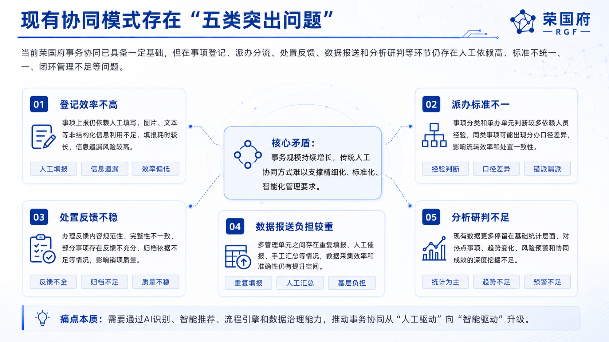
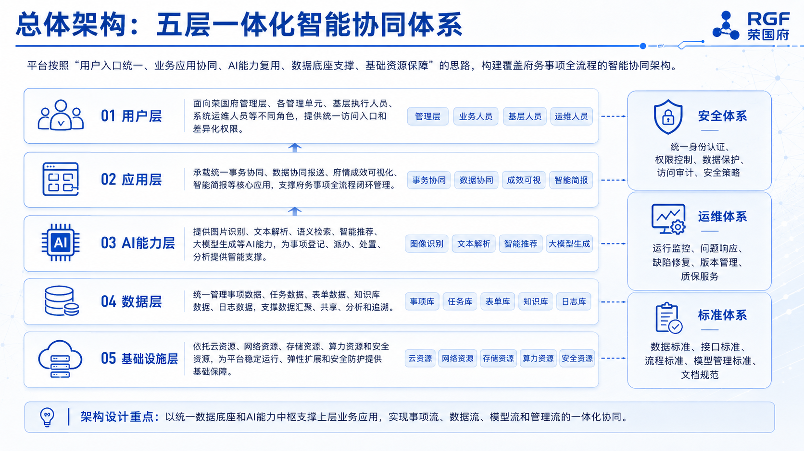
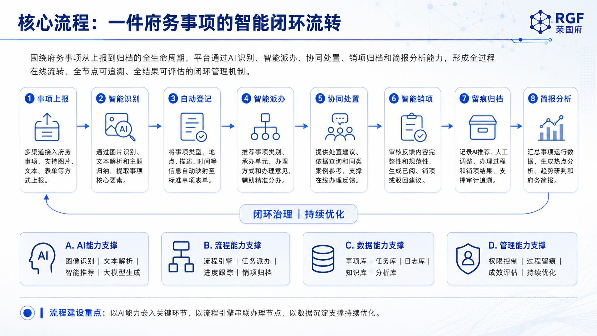

# 国央企汇报 PPT 生成 Skill

面向国央企、政企和数字化项目汇报材料的 image-first PPT 生产 Skill。

本 Skill 适用于项目立项会、总办会、上会汇报、数字化转型方案、AI 赋能汇报、产品解决方案、工作总结等场景。它不会优先生成可编辑 PPTX，而是围绕正式汇报材料的生产流程，先生成高质量的 PPT 设计生产资料，包括视觉风格简报、PPT 提纲、逐页内容、生图提示词、外部素材计划和自检报告，再由图片模型、设计工具或人工设计流程继续生成页面、排版或打包。

完整用户使用说明见：[USAGE.md](USAGE.md)。

---

## 适用场景

本 Skill 适合以下类型的中文企业汇报材料：

- 国央企上会汇报
- 政企数字化项目方案
- AI 赋能建设方案
- 信息化系统立项材料
- 项目工作总结
- 产品解决方案 PPT
- 内部培训课件
- 咨询式方案汇报

---

## 示例效果

以下为本 Skill 生成的国央企风格汇报材料示例。完整 18 页示例请下载 Release 附件中的 `sample-output-v1.0.0.pdf`。

### 封面示例


### 问题分析页示例



### 总体架构页示例



### 核心流程页示例



---

## 核心能力

本 Skill 不是简单生成 PPT 文案，而是模拟一套完整的企业汇报材料生产流程：

- 解析用户上传的文字、资料、参考内容和风格要求
- 判断是否有参考图、历史 PPT、品牌手册或自定义视觉风格
- 在缺少视觉参考时，自动使用默认“国央企/政企正式汇报风格”
- 生成汇报材料整体结构和页面提纲
- 生成逐页内容稿
- 生成逐页高密度生图提示词
- 规划需要使用的外部官方素材
- 支持先生成前 3-5 页样图，用户确认后再继续全量生成
- 生成结构、内容、提示词、图片和 PDF 自检报告

---

## 交付内容

运行后核心产物写入 `output/`：

- `00_visual_style_brief.md`：视觉风格简报
- `01_ppt_outline.md`：PPT 提纲
- `02_slide_content.md` / `slide_content.json`：逐页内容
- `03_image_prompts.md` / `image_prompts/slide_XX.txt`：逐页高密度生图提示词
- `04_generation_guide.md`：生成说明
- `05_review_checklist.md`：审查清单
- `external_assets/asset_plan.md`：外部素材计划
- `checks/*.md`：结构、内容、提示词、图片与 PDF 自检报告

---

## 快速开始

将用户材料放入 `input/` 目录，例如：

```text
input/
└── materials.md
```

然后依次运行主流程脚本：

```bash
python3 scripts/parse_inputs.py
python3 scripts/detect_visual_style.py
python3 scripts/build_outline.py
python3 scripts/build_slide_content.py
python3 scripts/build_image_prompts.py
python3 scripts/plan_external_assets.py
python3 scripts/search_and_download_assets.py
python3 scripts/generate_sample_images.py
python3 scripts/run_checks.py
```

如果用户没有上传参考图、历史 PPT、品牌手册或自定义风格描述，流程会直接使用默认“国央企/政企正式汇报风格”，无需反复要求用户补充视觉参考。

---

## 样图确认后继续全量生成

默认流程会先生成前 3-5 页样图。只有在用户确认样图方向后，才继续全量生成。

```bash
python3 scripts/generate_full_images.py --confirmed
python3 scripts/build_pdf_from_images.py
python3 scripts/run_checks.py
```

如果用户明确要求一次性生成完整版本，也可以跳过样图确认流程。

---

## 生图提示词机制

`scripts/build_image_prompts.py` 会根据国央企/政企正式汇报风格规则，生成长格式、结构化、高约束的页面级生图提示词。

每页提示词通常包含：

- 全局设计控制要求
- 视觉风格来源
- 默认风格兜底规则
- 页面版式类型
- 主视觉结构
- 页面内容模块
- 字体、标题线、卡片、图标、Logo、间距规则
- 禁止出现的设计问题
- 页面生成自检清单

本 Skill 生成的提示词不是简单的英文风格短句，而是用于驱动 GPT-Image-2、图片生成模型或人工设计流程的详细页面生产说明。

---

## 外部素材处理

如需规划和下载外部官方素材，可以运行：

```bash
python3 scripts/plan_external_assets.py
python3 scripts/search_and_download_assets.py
```

当网络不可用时，下载脚本不会伪造素材，而是输出推荐的官方搜索来源和素材获取建议。

---

## 目录结构

```text
guoqi-report-ppt-skill/
├── README.md
├── SKILL.md
├── USAGE.md
├── input/
│   └── materials.md
├── output/
│   └── .gitkeep
├── examples/
│   └── ai_empowerment/
│       └── input.md
├── assets/
│   └── preview/
│       ├── cover.png
│       ├── problem-analysis.png
│       ├── architecture.png
│       └── workflow.png
└── scripts/
    ├── parse_inputs.py
    ├── detect_visual_style.py
    ├── build_outline.py
    ├── build_slide_content.py
    ├── build_image_prompts.py
    ├── plan_external_assets.py
    ├── search_and_download_assets.py
    ├── generate_sample_images.py
    ├── generate_full_images.py
    ├── optimize_after_feedback.py
    ├── build_pdf_from_images.py
    ├── run_checks.py
    └── workflow_common.py
```

---

## 交付包说明

本仓库不包含任何私有 API Key。

如需自动调用图片模型，请在使用方环境中自行配置图片生成能力；未配置时，Skill 仍会稳定生成完整提示词、页面内容和审查材料。

`output/` 属于运行产物目录，交付版默认保持为空。

---

## 授权说明

本项目仅用于学习、研究、内部测试和非商业演示。

未经作者或权利方书面授权，不得用于商业项目交付、客户项目实施、二次销售，或集成到 SaaS、Agent 平台、PPT 生成平台及其他商业产品中。

如需商业授权，请联系项目维护者。
